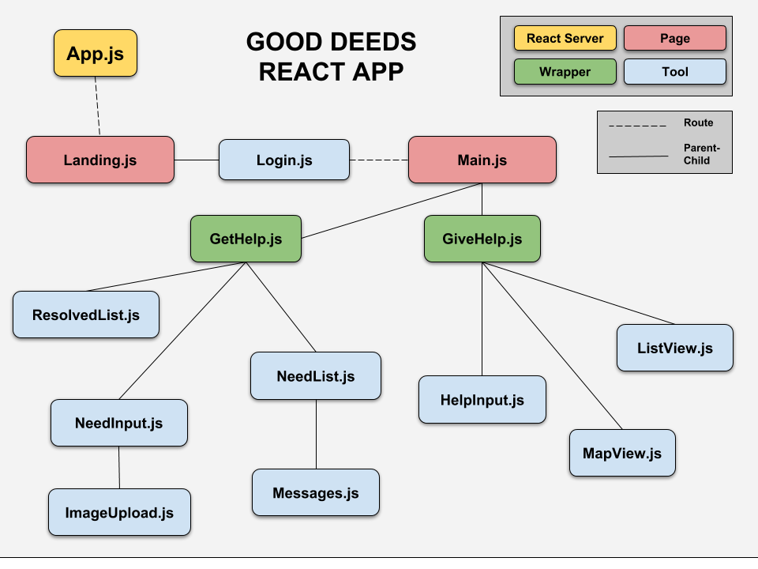

# Good Deeds

This app aims to promote good deeds - direct, person-to-person acts of kindness, service, or financial assistance - for people who live in low-income neighborhoods. The idea began as a way to connect people in low-income neighborhoods with service providers who were willing to donate home repair services, but our group quickly saw its potential to match users with a much wider variety of personal and professional services. 

### Team
* Members
    * AJ Jordan || [enigmatic-agent-scully](https://github.com/enigmatic-agent-scully) || ___aj
    * Erik Woodworth || [spinozist](https://github.com/spinozist) || spinozist
    * Hayden Estes || [haydest](https://github.com/haydest) || haydest
    * Mike Baghari || [mb480s](https://github.com/mb480s) || MikeB

### React App Diagram

### Requirements

* Must use React, Vue, or Angular in some way (even if minimal)

* Must use a Node and Express Web Server

* Must be backed by a MySQL or MongoDB Database with a Sequelize or Mongoose ORM

* Must have both GET and POST routes for retrieving and adding new data

* Must be deployed using Heroku (with Data)

* Must utilize at least two libraries, packages, or technologies that we haven’t discussed

* Must have a polished frontend / UI

* Must have folder structure that meets MVC Paradigm

* Must meet good quality coding standards (indentation, scoping, naming)

* Must not expose sensitive API key information on the server, see Protecting-API-Keys-In-Node.md
