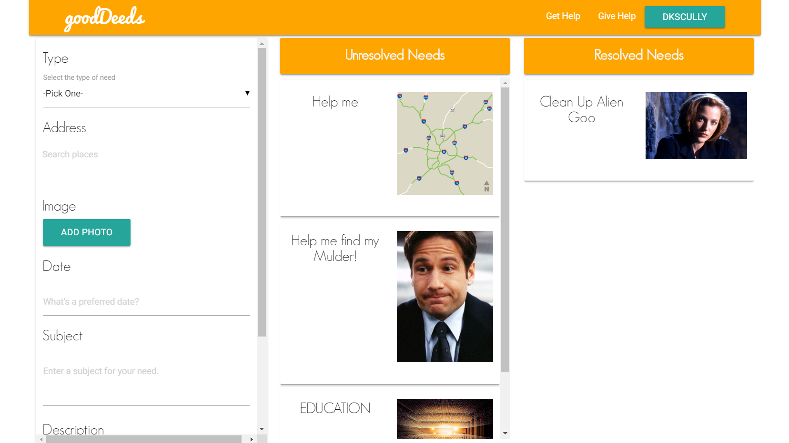
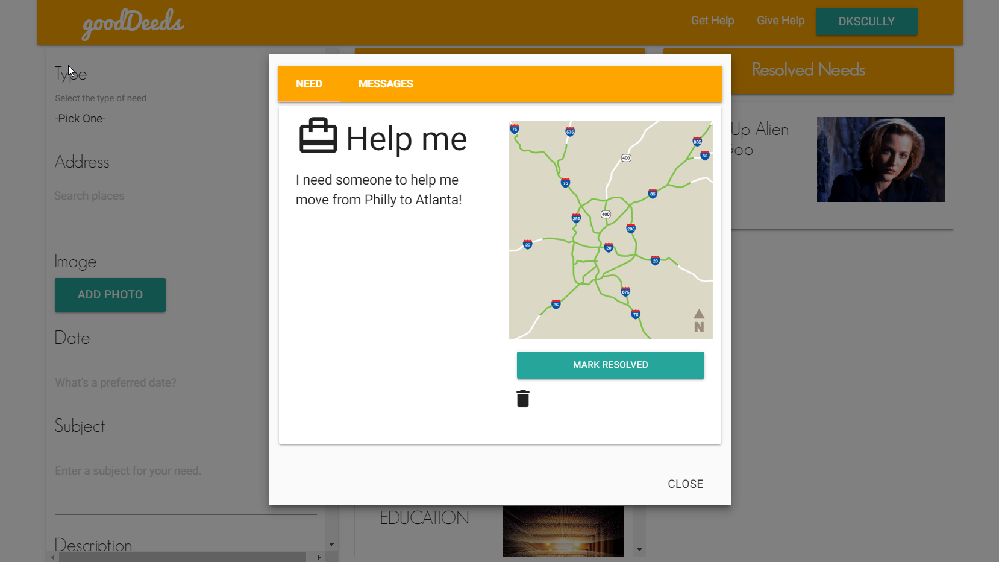
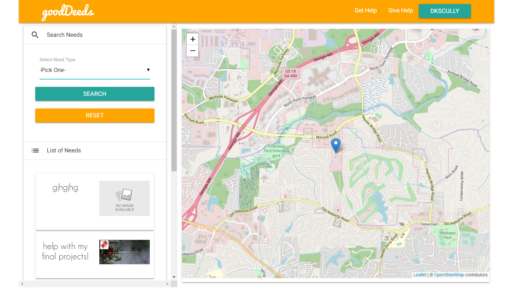
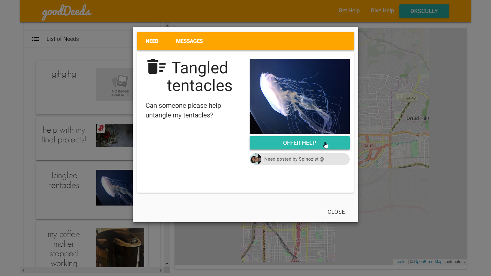
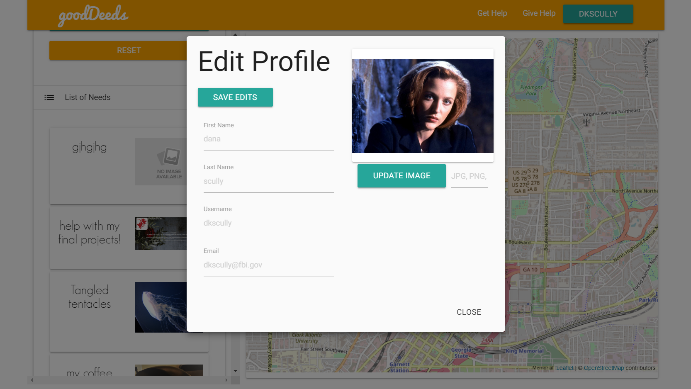

# GoodDeeds

> Where good deeds meet real needs

## Description

This project was created with the MERN stack -- MongoDB, Express, React, and Node.

This app aims to promote good deeds - direct, person-to-person acts of kindness, service, or financial assistance - for people in need. The idea began as a way to connect people in low-income neighborhoods with service providers who were willing to donate home repair services, but our group quickly saw its potential to match users with a much wider variety of personal and professional services.

### Usage

#### Logging In

Please note that while this project has user authentication, it is unwise to create an account with any personally identifying information. To log into and view the site, please either create a dummy account or use the following credentials:

```
email: testaccount@test.com
password: test
```

#### Get Help

The Give Help page includes a form that allows the currently authenticated user to create a post that includes the details of their need. The page also displays a list of Unresolved Needs and Resolved Needs.



The current user can mark their own need as 'Resolved' at their discretion, at which point it will move from the Unresolved to Resolved Needs list.



#### Give Help

The Give Help page allows the current user to view the needs posted by other members in list form as well by location.



Users can comment on and volunteer to help fulfill others' needs.



Users can also edit their profile information after creating their account.



### Team

- Members
  - AJ Jordan || [enigmatic-agent-scully](https://github.com/enigmatic-agent-scully)
  - Erik Woodworth || [spinozist](https://github.com/spinozist)
  - Mike Baghari || [mb480s](https://github.com/mb480s)
